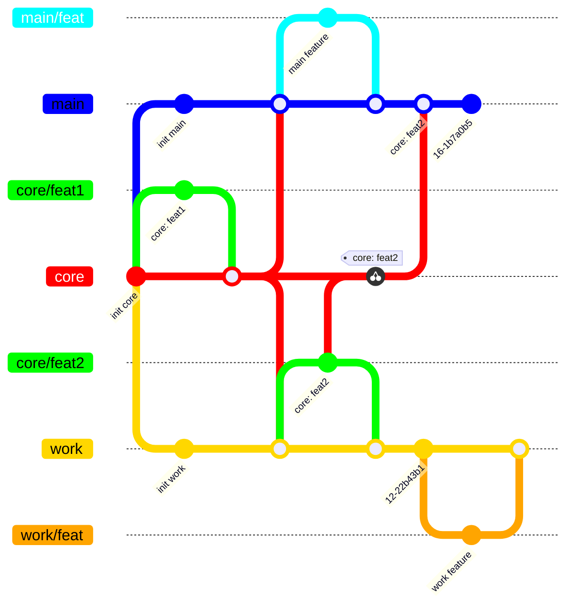

# dotfiles-repo Branching Strategy

```mermaid
---
config:
  theme: default
  gitGraph:
    mainBranchOrder: 3
    mainBranchName: core
    parallelCommits: true
  themeVariables:
    git0: "#00FFFF"
    git1: blue
    git2: "#00FF00"
    git3: red
    git4: "#00FF00"
    git5: gold
    git6: orange
---
gitGraph
    %% Core branches
    commit id: "init core"

    checkout core
    branch main order: 1
    commit id: "init main"

    checkout core
    branch work order: 5
    commit id: "init work"

    %% main core
    checkout core
    branch core/feat1 order: 2
    commit id: "core: feat1"

    checkout core 
    merge core/feat1
    

    checkout main
    merge core
    %% cherry-pick id: "core: feat1" tag: "core: feat1"

    checkout work
    merge core
    %% merge core id: "core: feat1 "
    %% commit

    %% main feature
    checkout main
    branch main/feat order: 0
    commit id: "main feature"

    checkout main
    merge main/feat

    %% Work core
    checkout work
    branch core/feat2 order: 4
    commit id: "core: feat2"

    checkout work
    merge core/feat2

    checkout core
    cherry-pick id: "core: feat2" tag: "core: feat2"

    checkout work
    commit

    checkout main
    merge core id: "core: feat2 "

    %% Work feature
    checkout work
    branch work/feat order: 6
    commit id: "work feature"

    checkout work
    merge work/feat
    
    checkout main
    commit

    %% checkout main
    %% commit

```

